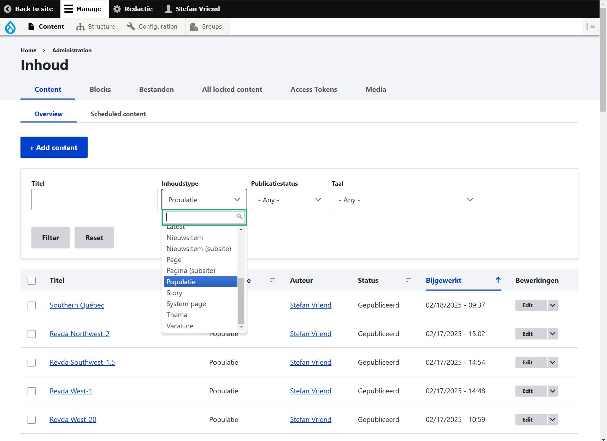

# metadata

> Code to process SPI-Birds metadata submissions through Jotform

## Introduction

As part of SPI-Birds Network and Database, we collect metadata of various studies on birds through our [metadata entry Jotform](https://eu.jotform.com/form/230361997667066). This R package provides the code to process Jotform's metadata submissions, and add them to the [SPI-Birds website](https://spibirds.org).

### Questions or feedback

If you have questions or feedback on the metadata form, or this R package, please reach out to us via the [issues page](https://github.com/SPI-Birds/metadata/issues) on this GitHub repository or by sending an email to [spibirds\@nioo.knaw.nl](mailto:spibirds@nioo.knaw.nl).

------------------------------------------------------------------------

*for the SPI-Birds Team*

## Installation

### PhantomJS

Maps are created through screenshots of the interactive html maps of [leaflet](https://leafletjs.com/). For this, [PhantomJS](https://phantomjs.org/) needs to be installed.

``` r
# Install PhantomJS through {webshot} (Windows only)
if(!webshot::is_phantomjs_installed()) {
  
  webshot::install_phantomjs()
  
}
```

On Mac, using Homebrew, type:

```         
brew tap homebrew/cask
brew cask install phantomjs
```

## Access & editing rights

### GitHub repository

If you have troubles cloning this repository locally, contact Stefan ([s.vriend\@nioo.knaw.nl](mailto:s.vriend@nioo.knaw.nl)) to get access.

### Google Drive & Sheets

Contact Stefan ([s.vriend\@nioo.knaw.nl](mailto:s.vriend@nioo.knaw.nl)) to get access to the [SPI-Birds metadata folder](https://drive.google.com/drive/folders/1yULGc0yzyMqOfuouSTL3W7UVw5yReHSQ?usp=drive_link), the [SPI-Birds metadata sheet](https://docs.google.com/spreadsheets/d/1sNlpXSbZtGXD_gfvDRcGdUUmfepOVKOOfL6s4znBB20/) and the [SPI-Birds overview sheet](https://docs.google.com/spreadsheets/d/1LoTxe8nIb2qXKagm9ATYzG2NeLp9KHMC9oRb3uKsw1w/edit?gid=1178676937#gid=1178676937).

### SPI-Birds website

To get access to the SPI-Birds website, which is part of NIOO's web sites, you first have to log in through an eduID associated with your email address.

1. Go to [https://nioo.knaw.nl/en](https://nioo.knaw.nl/en).  
2. Click 'Log in' in the top right.  
3. Click 'Log in'.  
4. Click on 'Use another account'.  
5. Click on 'eduID (NL)'.
6. Click on 'No eduID? Create one!'.
7. Provide email address, first name and last name.
8. Read and agree to the terms of service and privacy policy.
9. Click 'Request your eduID'.
10. Go to your email and verify your email address for your eduID. You should then receive an email confirming that your eduID has been created.

Once yourd eduID is set up and linked to the NIOO website, contact Stefan ([s.vriend\@nioo.knaw.nl](mailto:s.vriend@nioo.knaw.nl)) to get editing rights to the [SPI-Birds website](https://spibirds.org). This is done via by the web service team of NIOO, and might take some time to be completed.

## Workflow

### 0. Check for new metadata submissions

Check the [SPI-Birds overview sheet](https://docs.google.com/spreadsheets/d/1LoTxe8nIb2qXKagm9ATYzG2NeLp9KHMC9oRb3uKsw1w/edit?gid=1178676937#gid=1178676937) for new metadata submissions. Mark your initials in the "metadata_processed_by" column when you start processing an entry.


### 1. Pull latest changes & load package

Pull the latest changes of this repository.

``` r
git pull
```

Load package developer environment.

``` r
# Open the R project in the main directory of this repo and load complete package
devtools::load_all(".")
```

### 2. Check Google Sheet

Navigate to the SPI-Birds metadata Google Sheet.

``` r
browseURL("https://docs.google.com/spreadsheets/d/1sNlpXSbZtGXD_gfvDRcGdUUmfepOVKOOfL6s4znBB20/")
```

Double check that all values for the metadata entry are filled in as expected, without typos. For example:

-   check format of coordinates. Sometimes custodians provide coordinates in degrees, minutes, seconds as decimal degrees, which are somewhat off compared to actual decimal degrees.
-   check whether the DOI is resolvable. DOIs do not necessarily need a prefix for the script to read them correctly. If they do have a prefix, it should be one of: `doi:`, `https://doi.org/`, `doi.org/`.

### 3. Convert Jotform entry to EML.xml

``` r
# Convert metadata entry to EML
# Use the email address with which you have access to the Google Sheet
meta <- convert_to_eml("example@example.com")
```
The code prompts you to pick a three-letter code for the study site. These can be the first three letters of the name, or the three starting letters if the study site consists of minimally three words. The script will prompt you when a code has already been taken. Please use the [SPI-Birds overview sheet](https://docs.google.com/spreadsheets/d/1LoTxe8nIb2qXKagm9ATYzG2NeLp9KHMC9oRb3uKsw1w/edit?gid=1178676937#gid=1178676937) for inspiration how other study names relate to their three-letter codes.

The code might also prompt you to select a taxon id associated with a species. Enter the **row number** of the record that matches the species. Most often this is the record where rank = species (often row number 1).

### 4. Add processed metadata to SPI-Birds internal tables

``` r
# Add metadata to internal tables
add_metadata(meta)

# Reload package environment
devtools::load_all(".")
```
The code prompts you to provide a code for the institution associated with the metadata submission. There is no limit to the number of letters you can use here. Again, please use the [SPI-Birds overview sheet](https://docs.google.com/spreadsheets/d/1LoTxe8nIb2qXKagm9ATYzG2NeLp9KHMC9oRb3uKsw1w/edit?gid=1178676937#gid=1178676937) for inspiration how other institutions relate to their codes.

### 5. Create screenshot of Leaflet map

``` r
create_map(meta$siteID)
```

### 6. Add metadata to website

#### Open a recent metadata web page

We use a recent metadata web page as a template for the web page of the new metadata submission.

1. Go to [https://nioo.knaw.nl/en](https://nioo.knaw.nl/en).
2. Log in to the website using your eduID.

> [!TIP]
> If you do not have an eduID yet, please follow [these instructions](#spi-birds-website).

3. Click on `Content`.
4. Select as `Inhoudstype` (content type) `Populatie` and click `Filter`.
5. Find one of the recent created web pages and click `Edit`.



From here on, the instructions will refer to this web page as the "template".


#### Create a new page for the metadata submission

6. In a second tab, go to [https://nioo.knaw.nl/en](https://nioo.knaw.nl/en).
7. Hover over to `Content` > `Add Content` and click `Populatie`.


#### Fill new page with filter metadata

Filling the web page we do using the xml file created in [step 3](#3-convert-jotform-entry-to-emlxml).

First, we fill in the necessary fields that relate to the filters on the [SPI-Birds map](https://nioo.knaw.nl/en/projects/spi-birds/studies) and the blue 'Details' box of a study's page (e.g., [page for Hoge Veluwe](https://nioo.knaw.nl/en/projects/spi-birds/study/hoge-veluwe))

8. For **Title**, fill in the name of the study site.
9. For **Summary**, copy the text from the template and replace the codes, site name, and country.
10. In the **Revision log message** on the right, write 'initial submission'.
11. For **Main image**, click `Add media`.
    - Click `Choose file`.
    - Find the map in `~\metadata\inst\extdata\maps` and open.
    - For `Language`, select English.
    - For `Alternative text`, fill in *Map of \<site name\>, \<country\>*.
    - For `Credits`, fill in *OpenStreetMap*.
    - Click `Save` and `Insert selected`.
12. For **Latitude**, copy the coordinates from the xml file. If a bounding box is given, provide the average from the north and south bounding coordinate.
13. For **Longitude**, copy the coordinates from the xml file. If a bounding box is given, provide the average from the west and east bounding coordinate.
14. Under **Metadata**
    - Click `Choose file`.
    - Find the xml file in *~\metadata\inst\extdata\eml* and open.
15. Under **Dataset Request**
    - Leave **URL** empty.
    - Leave **Link text** empty.
16. Under **Details**
    - For **Country**, select the country (if unavailable, see [Add country](#add-country-to-list-of-options)).
    - For **Species**, select the species (if unavailable, see [Add species](#add-species-to-list-of-options)).
    - For **Data pipeline**, keep default (`No`).
    - For **Max. nr. of nestboxes**, fill in if relevant.
    - For **Nests monitoerd**, leave empty.
    - For **Start year**, select one of three options. Note that the direction of the arrows is wrong.
    - For **Running period**, tick `Current` if the study is ongoing.
    - For **Starts**, fill in the first year of the study.
    - For **Ends**, fill in the last year of the study. This field disappears when the `Current` button is ticked.
    - For **ID data**, select relevant mark types.
    - For **Environmental data**, select relevant measurements.
    - For **Individual data**, select relevant measurements.
    - For **Habitat**, select relevant habitat if available.
    - For **Genetic data**, select relevant samples taken.
    - For **Basic breeding data**, click `Yes`. This should always be `Yes`, because otherwise the study is not fit for SPI-Birds.
    - For **Winter data**, select the relevant activities.
    - For **Feeding at nest data**, select whether feeding activity was measured.
17. Click `Save`.

A green info box should appear that says: "Populatie \<studyID\> has been created."


#### Fill new page with metadata tables and update url

Then, we re-edit the page, add the html tables, and update the url.

18. Click `Edit`.
19. In the **Revision log message** on the right, write 'add tables + update url alias'.
20. In the **URL alias** box on the right  
    - Untick `Generate automatic URL alias`. The greyed-out text box should become editable.
    - In the text box, add '/project/spi-birds' at the start, so that it reads '/project/spi-birds/study/\<study name\>', where study name corresponds to the title of the web page.
21. On the left side, go to **Content**. Here we will create the three metadata tables based on the tables of the template.  
    - Click on the downward arrow, and click `Add Text`.
    - A text box should appear. In the header of the box, click on `Source`.
    - Move over to the template tab, go to the first content item (also a text box), and click `Edit`.
    - Click `Source` and copy the entire html code.
    - Move over to the tab of the new study, and paste the html code there.
    - Unclick `Source` to go back to the visual editor. You should now see a table.
    


22. For the General Information table, fill the fields as follows:
    - For **Responsible Party**, copy the \<creator\>, which is either the organisation name *or* the name of the person and their ORCID (e.g., Stefan Vriend (ORCID: 0000-0002-9006-5988))
    - For **Contact**, copy the \<contact\>, i.e., the name of the person, their email address, and their ORCID (e.g., Stefan Vriend (s.vriend@nioo.knaw.nl, ORCID: 0000-0002-9006-5988))
    - For **Organisation**, copy the organisation name associated with the \<creator\>. 
    - For **Other team members**, copy \<personnel\>, i.e., the name of the person, their email address, and their ORCID.
    - For **Data availability**, keep the default. This will be updated when we actually receive data files.
    - For **Data license**, keep empty. This will be updated when we actually receive data files.
    - For **Funding**, copy \<funding\> if available.
23. Repeat step 21, create a new text box (i.e., click `Add Text`), and copy the source code of the *second table* in the template. Then fill the Study site table as follows:
    - For **Name**, copy the site name from \<geographicDescription\>.
    - For **ID**, fill in the three-letter code for the site.
    - For **Country**, copy the country from \<geographicDescription\>.
    - For **Size (ha)**, copy the surface area descriptor that is part of \<studyAreaDescription\>.
    - For **Major site changes**, copy the text following "Information related to (major) changes to the study site, supplied by the metadata provider" in \<designDescription\>.
    - For **Latitude (decimal degrees N)**, copy \<northBoundingCoordinate\> or \<southBoundingCoordinate\>. If a bounding box is given, provide both.
    - For **Longitude (decimal degrees E)**, copy \<westBoundingCoordinate\> or \<eastBoundingCoordinate\>. If a bounding box is given, provide both.
    - For **Minimum elevation (m)**, copy \<altitudeMinimum\> if available.
    - For **Maximum elevation (m)**, copy \<altitudeMaximum\> if available.
    - For **Number of nests (min)**, copy the minimum number from the field in \<designDescription\> that starts with "The field study monitors artificial nest boxes".
    - For **Number of nests (max)**, copy the maximum number from the field in \<designDescription\> that starts with "The field study monitors artificial nest boxes".
    - For **EUNIS habitat code**, copy the habitat codes provided in \<studyAreaDescription\>. Separate them by ' | '. For example: "G: Woodland, forest and other wooded land | G1: Broadleaved deciduous woodland | G1.1: Riparian and gallery woodland, with dominant alder, birch, poplar or willow"
    - For **Description of study site**, copy the doi from \<referencePublication\> (formatted as https://doi.org/XXXX-XXXX) if available, and copy the text that follows "Link to website that describes project/field study" in \<designDescription\> if available.
24. Repeat step 21, create a new text box (i.e., click `Add Text`), and copy the source code of the *third table* in the template. Then fill the Study site table as follows:
    - For **Species**, go to \<taxonomicCoverage\> and copy the \<taxonRankValue\> of the lowest rank (either species or subspecies). Make sure the name is italicised.
    - For **Start year**, copy the first year from \<title\>.
    - For **End year**, copy the last year from \<title\>. If title says "ongoing", leave **End year** empty.
    - For **Continuous collection of data**, keep default ("Yes") unless there are gap years mentioned in \<designDescription\>; then write "No".
    - For **Gap years**, copy the gap years mentioned in \<designDescription\> if available.
    - For **Longest data collection**, keep empty.
    - For **Tagging**, copy the tags mentioned in paragraph 'Tagging' of \<methods\>.
    - For **Brood data collected**, copy the measurements mentioned in paragraph 'Brood data' of \<methods\>.
    - For **Individual data collected**, copy the measurements mentioned in paragraph 'Individual data' of \<methods\>.
    - For **Environmental data collected**, copy the (biotic and abiotic) measurements mentioned in paragraph 'Environmental data' of \<methods\> if available.
    - For **Genetic data collected**, copy the samples mentioned in paragraph 'Genetic data' of \<methods\>.
    - For **Experimental manipulations**, write "Yes" if any experimental manipulations are mentioned in paragraph 'Other activities' of \<methods\>, else write "No".
    - For **Description of experimental manipulations**, copy any descriptions of experimental manipulations mentioned in paragraph 'Other activities' of \<methods\> if available.
    - For **Other activities**, copy any other activities than experiments mentioned in paragraph 'Other activities' of \<methods\>.
25. Scroll down and click `Save`.
26. Go to the tab of the template
    - Scroll down and click `Unlock`.
    - If the browser reminds you that you leave without saving changes, please ignore and leave. 
    - Click `Confirm break lock`.

A green info box should appear that says: "Unlocked. Anyone can now edit this content." 

#### Add country to list of options

If the new metadata entry is associated with a country new to SPI-Birds, add them to filter list as follows.

1. Go to [https://nioo.knaw.nl/en](https://nioo.knaw.nl/en).
2. Log in to the website using your eduID.
3. Hover over to `Structure` > `Taxonomy` and click `SPI-Birds country options`.
4. Click `Add term`.
5. In the field **Name**, write the English name of the country.
6. Scroll down and click `Save`.

#### Add species to list of options

If the new metadata entry is associated with a species new to SPI-Birds, add them to filter list as follows.

1. Go to [https://nioo.knaw.nl/en](https://nioo.knaw.nl/en).
2. Log in to the website using your eduID.
3. Hover over to `Structure` > `Taxonomy` and click `SPI-Birds species options`.
4. Click `Add term`.
5. In the field **Name**, write the English name of the (sub)species.
6. In the field **Description**, write the scientific name of the (sub)species. Make sure the name is italicised.
7. Scroll down and click `Save`.

## 7. Commit and push changes to GitHub

Commit:

-   updated internal tables in [inst/extdata](/inst/extdata)
-   archived internal tables in [inst/extdata/archive](/inst/extdata/archive)

Use a concise and informative commit message, such as "Process submission for \<siteID\>" or "Add metadata for \<siteID\>", where \<siteID\> is the three-letter code for the submitted entry.

## 8. Inform SPI-Birds team and contributors

The final step is sharing the new web page with the rest of the SPI-Birds team and inform the contributors that the website is live.

- Inform [spibirds@nioo.knaw.nl](mailto:spibirds@nioo.knaw.nl) or [Stefan](mailto:s.vriend@nioo.knaw.nl) that a new web page is created.
- Upload the xml file and the map to the [metadata folder on Google Drive](https://drive.google.com/drive/folders/1yULGc0yzyMqOfuouSTL3W7UVw5yReHSQ?usp=drive_link), so that the can be archived on the NIOO servers.
- Inform the contributors that the web page of their study is now live. Cc spibirds@nioo.knaw.nl. Use the [email template](/inst/extdata/email-template).
